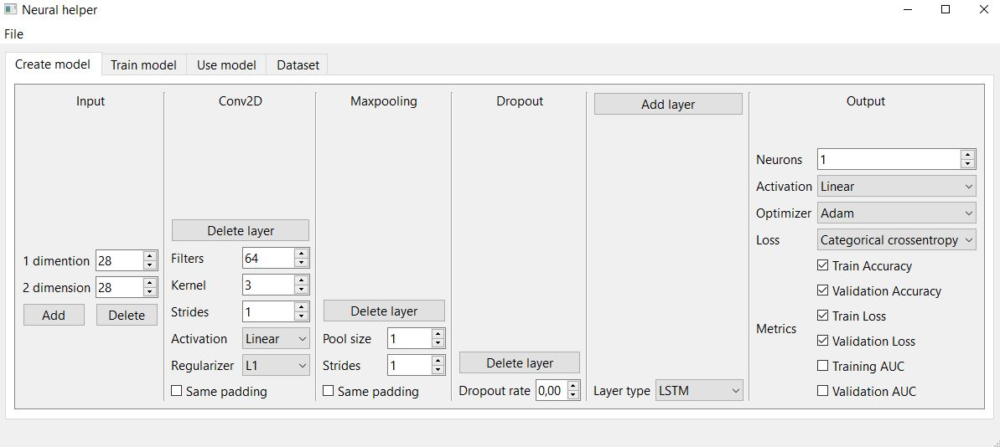
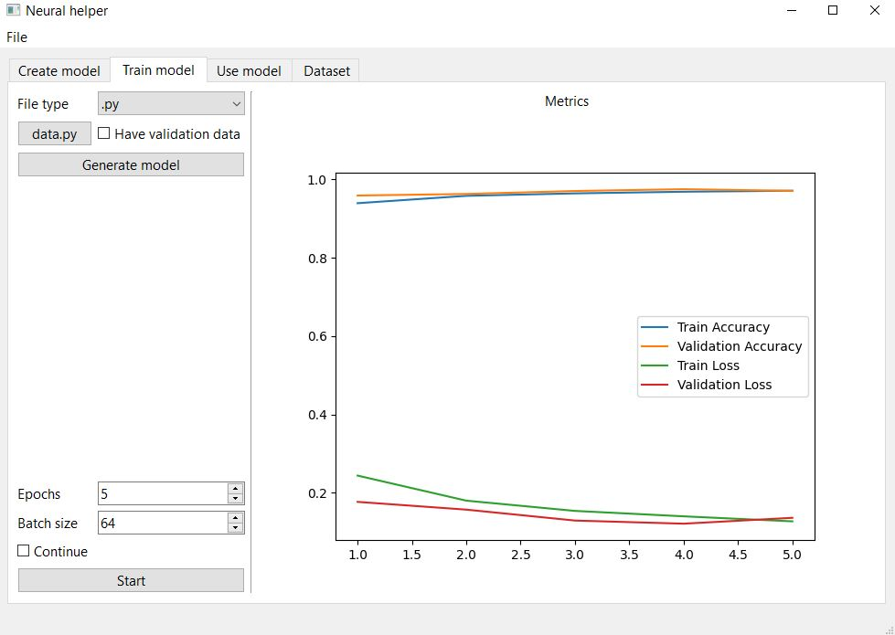
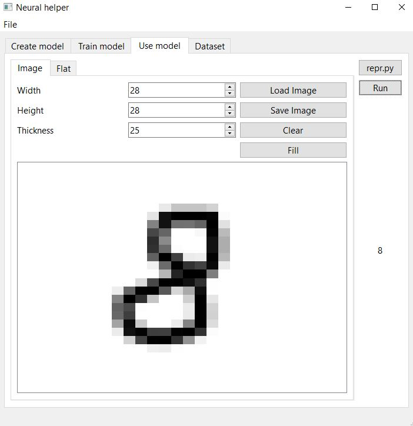
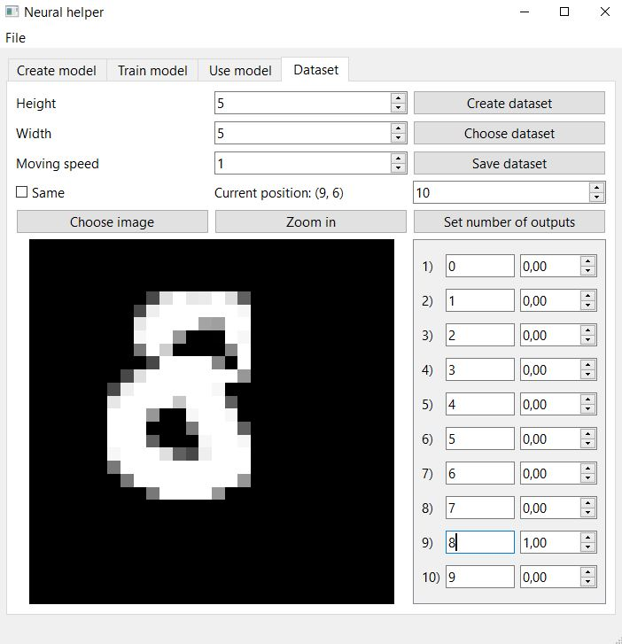

# NeuralHelper
Небольшое графическое на основе **PyQt** приложение, которое помогает создавать и тренировать многослойные нейросети библиотеки **keras**, генерировать простые наборы данных 

## Команды 
- Установка зависимостей: `pip install -r requirements.txt`
- Скомпилировать .ui файлы: `python utils/compile.py` 
- Запустить приложение: `python main.py`

## Основная функциональность
### Создание моделей в графическом интерфейсе
- Выбор измерений входного слоя
- Выбор и настройка промежуточных слоев
- Настройка конечного слоя и выбор метрик для измерения
- Загрузка и сохранение моделей

### Тренировка модели
- Выбор файла с данными
- Настройка параметров обучения
- Вывод метрик на график в процессе обучения

### Использование модели
Передача на вход загруженной модели одного экземпляра данных и вывод результата
- Рисование в окне для создания графических (2D) данных 
  - Пикселизация рисунка
  - Настройка кисти
  - Настройка холста
- Загрузка изображений
- Сознание одномерных наборов данных

### Генерация набора данных
- Загрузка изображений
- Приближение и перемещение по изображению, настройка окна
- Настройка выходных данных
- Сохранение и загрузка набора дынных

